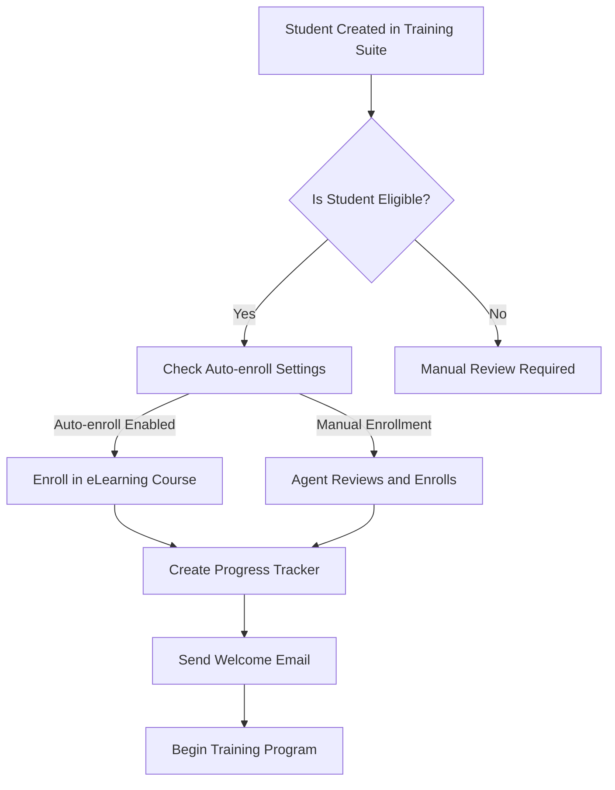
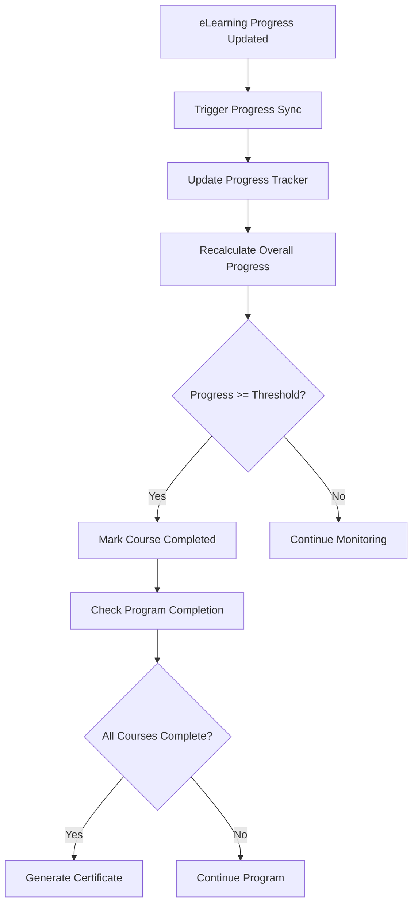
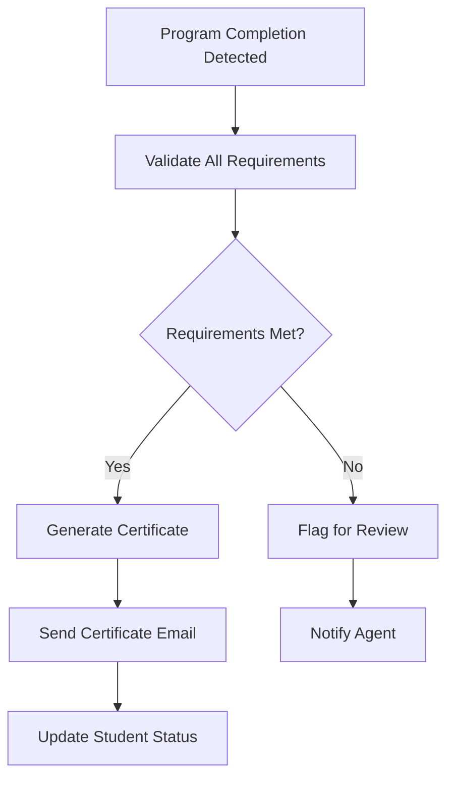

# Odoo eLearning Integration Plan
## Grants Training Suite v2 - eLearning Module Integration

### 📋 Overview
This document outlines the integration plan between our custom Grants Training Suite module and Odoo's built-in eLearning module. The integration will allow us to leverage Odoo's course management capabilities while maintaining our specialized training workflow and student management features.

### 🎯 Integration Goals

#### Primary Objectives
1. **Seamless Course Management**: Use Odoo eLearning courses as the foundation for our training programs
2. **Enhanced Student Tracking**: Link eLearning enrollments with our student management system
3. **Unified Progress Monitoring**: Track both eLearning progress and our custom training metrics
4. **Integrated Certification**: Generate certificates based on eLearning completion and our custom assessments
5. **Streamlined Workflow**: Maintain our existing training workflow while leveraging eLearning features

#### Secondary Objectives
1. **Data Synchronization**: Keep student data synchronized between both systems
2. **Reporting Integration**: Combine eLearning analytics with our custom reporting
3. **User Experience**: Provide a unified interface for both systems
4. **Scalability**: Support multiple training programs and course types

### 🏗️ Architecture Overview

#### Current State
```
Grants Training Suite v2 (Custom Module)
├── Student Management (gr.student)
├── Course Sessions (gr.course.session) - Custom sessions
├── Homework Attempts (gr.homework.attempt)
├── Certificates (gr.certificate)
└── Document Management (gr.document.request)
```

#### Target State
```
Integrated Training System
├── Odoo eLearning Module
│   ├── Course Management (slide.channel)
│   ├── Content Management (slide.slide)
│   ├── Enrollment Tracking (slide.channel.partner)
│   └── Progress Tracking (slide.slide.partner)
├── Grants Training Suite v2 (Enhanced)
│   ├── Student Management (gr.student) - Enhanced with eLearning data
│   ├── Course Integration (gr.course.integration) - NEW
│   ├── Session Management (gr.course.session) - Enhanced
│   ├── Assessment Integration (gr.assessment.integration) - NEW
│   ├── Progress Tracking (gr.progress.tracker) - NEW
│   └── Certificate Generation (gr.certificate) - Enhanced
└── Unified Dashboard (gr.training.dashboard) - NEW
```

#### Integration Flow Diagram
```
┌─────────────────┐    ┌──────────────────┐    ┌─────────────────┐
│   eLearning     │    │   Integration    │    │  Training Suite │
│   Module        │    │    Layer         │    │   Module        │
├─────────────────┤    ├──────────────────┤    ├─────────────────┤
│ slide.channel   │◄──►│ gr.course.       │◄──►│ gr.student      │
│ (Courses)       │    │ integration      │    │ (Enhanced)      │
├─────────────────┤    ├──────────────────┤    ├─────────────────┤
│ slide.channel.  │◄──►│ gr.progress.     │◄──►│ gr.course.      │
│ partner         │    │ tracker          │    │ session         │
│ (Enrollments)   │    │                  │    │ (Enhanced)      │
├─────────────────┤    ├──────────────────┤    ├─────────────────┤
│ slide.slide.    │◄──►│ gr.assessment.   │◄──►│ gr.homework.    │
│ partner         │    │ integration      │    │ attempt         │
│ (Progress)      │    │                  │    │ (Enhanced)      │
└─────────────────┘    └──────────────────┘    └─────────────────┘
         │                       │                       │
         └───────────────────────┼───────────────────────┘
                                 │
                    ┌──────────────────┐
                    │  Unified         │
                    │  Dashboard       │
                    │  (gr.training.   │
                    │   dashboard)     │
                    └──────────────────┘
```

### 📊 Data Model Integration

#### 1. Enhanced Student Model (gr.student)
```python
# New fields to add
class Student(models.Model):
    _inherit = 'gr.student'
    
    # eLearning Integration
    elearning_enrollments = fields.One2many(
        'slide.channel.partner',
        'partner_id',
        string='eLearning Enrollments',
        domain=[('partner_id', '=', 'id')]
    )
    
    elearning_progress = fields.Float(
        string='eLearning Progress (%)',
        compute='_compute_elearning_progress',
        store=True
    )
    
    completed_courses = fields.Integer(
        string='Completed Courses',
        compute='_compute_completed_courses',
        store=True
    )
    
    # Integration status
    integration_status = fields.Selection([
        ('not_integrated', 'Not Integrated'),
        ('enrolled', 'Enrolled in eLearning'),
        ('in_progress', 'In Progress'),
        ('completed', 'Completed'),
        ('certified', 'Certified')
    ], string='Integration Status', default='not_integrated')
```

#### 2. New Course Integration Model (gr.course.integration)
```python
class CourseIntegration(models.Model):
    _name = 'gr.course.integration'
    _description = 'Course Integration between eLearning and Training Suite'
    
    name = fields.Char(string='Integration Name', required=True)
    
    # eLearning Course
    elearning_course_id = fields.Many2one(
        'slide.channel',
        string='eLearning Course',
        required=True
    )
    
    # Training Program
    training_program_id = fields.Many2one(
        'gr.training.program',  # New model
        string='Training Program'
    )
    
    # Integration Settings
    auto_enroll_eligible = fields.Boolean(
        string='Auto-enroll Eligible Students',
        default=True
    )
    
    completion_threshold = fields.Float(
        string='Completion Threshold (%)',
        default=100.0,
        help='Percentage required to consider course completed'
    )
    
    # Status
    status = fields.Selection([
        ('draft', 'Draft'),
        ('active', 'Active'),
        ('archived', 'Archived')
    ], string='Status', default='draft')
    
    # Statistics
    enrolled_students = fields.Integer(
        string='Enrolled Students',
        compute='_compute_enrolled_students'
    )
    
    completed_students = fields.Integer(
        string='Completed Students',
        compute='_compute_completed_students'
    )
```

#### 3. New Training Program Model (gr.training.program)
```python
class TrainingProgram(models.Model):
    _name = 'gr.training.program'
    _description = 'Training Program Definition'
    
    name = fields.Char(string='Program Name', required=True)
    description = fields.Text(string='Description')
    
    # Program Structure
    course_integrations = fields.One2many(
        'gr.course.integration',
        'training_program_id',
        string='Course Integrations'
    )
    
    # Requirements
    eligibility_criteria = fields.Text(
        string='Eligibility Criteria',
        help='Specific criteria for this program'
    )
    
    duration_weeks = fields.Integer(
        string='Duration (Weeks)',
        help='Expected program duration'
    )
    
    # Certification
    certificate_template_id = fields.Many2one(
        'gr.certificate.template',
        string='Certificate Template'
    )
    
    # Status
    status = fields.Selection([
        ('draft', 'Draft'),
        ('active', 'Active'),
        ('archived', 'Archived')
    ], string='Status', default='draft')
```

#### 4. Enhanced Progress Tracking (gr.progress.tracker)
```python
class ProgressTracker(models.Model):
    _name = 'gr.progress.tracker'
    _description = 'Unified Progress Tracking'
    
    student_id = fields.Many2one(
        'gr.student',
        string='Student',
        required=True
    )
    
    course_integration_id = fields.Many2one(
        'gr.course.integration',
        string='Course Integration',
        required=True
    )
    
    # eLearning Progress
    elearning_progress = fields.Float(
        string='eLearning Progress (%)',
        related='elearning_enrollment_id.completion'
    )
    
    elearning_enrollment_id = fields.Many2one(
        'slide.channel.partner',
        string='eLearning Enrollment'
    )
    
    # Custom Training Progress
    custom_sessions_completed = fields.Integer(
        string='Custom Sessions Completed'
    )
    
    homework_submissions = fields.Integer(
        string='Homework Submissions'
    )
    
    # Overall Progress
    overall_progress = fields.Float(
        string='Overall Progress (%)',
        compute='_compute_overall_progress'
    )
    
    # Status
    status = fields.Selection([
        ('not_started', 'Not Started'),
        ('in_progress', 'In Progress'),
        ('completed', 'Completed'),
        ('certified', 'Certified')
    ], string='Status', default='not_started')
```

### 🔄 Integration Workflows

#### 1. Student Enrollment Workflow


#### 2. Progress Synchronization Workflow


#### 3. Certificate Generation Workflow


### 🛠️ Implementation Phases

#### Phase 1: Foundation (Week 1-2)
**Objectives**: Set up basic integration infrastructure

**Tasks**:
1. **Create New Models**:
   - `gr.course.integration`
   - `gr.training.program`
   - `gr.progress.tracker`

2. **Enhance Student Model**:
   - Add eLearning integration fields
   - Implement computed fields for progress tracking
   - Add integration status management

3. **Basic Views**:
   - Course integration management views
   - Training program configuration views
   - Progress tracking dashboard

4. **Security Setup**:
   - Access rights for new models
   - User group permissions
   - Record rules for data access

**Deliverables**:
- New models created and tested
- Basic CRUD operations working
- Security properly configured

#### Phase 2: Core Integration (Week 3-4)
**Objectives**: Implement core integration functionality

**Tasks**:
1. **Enrollment Automation**:
   - Auto-enrollment based on eligibility
   - Manual enrollment workflows
   - Enrollment status synchronization

2. **Progress Synchronization**:
   - Real-time progress updates
   - Batch synchronization processes
   - Progress calculation algorithms

3. **Data Validation**:
   - Cross-system data consistency checks
   - Error handling and recovery
   - Data integrity validation

4. **Basic Reporting**:
   - Integration status reports
   - Progress tracking reports
   - Enrollment statistics

**Deliverables**:
- Automated enrollment working
- Progress synchronization functional
- Basic reporting available

#### Phase 3: Advanced Features (Week 5-6)
**Objectives**: Implement advanced integration features

**Tasks**:
1. **Unified Dashboard**:
   - Combined progress view
   - Real-time status updates
   - Interactive progress charts

2. **Advanced Analytics**:
   - Performance metrics
   - Completion rate analysis
   - Time-to-completion tracking

3. **Notification System**:
   - Progress milestone notifications
   - Completion alerts
   - Reminder system

4. **Certificate Integration**:
   - Automated certificate generation
   - eLearning completion validation
   - Certificate delivery system

**Deliverables**:
- Unified dashboard functional
- Advanced analytics working
- Certificate integration complete

#### Phase 4: Testing & Optimization (Week 7-8)
**Objectives**: Comprehensive testing and performance optimization

**Tasks**:
1. **Integration Testing**:
   - End-to-end workflow testing
   - Data synchronization testing
   - Error scenario testing

2. **Performance Optimization**:
   - Database query optimization
   - Caching implementation
   - Batch processing optimization

3. **User Acceptance Testing**:
   - User interface testing
   - Workflow validation
   - Performance testing

4. **Documentation**:
   - User manual updates
   - Technical documentation
   - Training materials

**Deliverables**:
- All tests passing
- Performance optimized
- Documentation complete

### 📊 Data Flow Architecture

#### 1. Student Data Flow
```
Training Suite Student → eLearning Partner → Progress Tracker → Certificate
```

#### 2. Course Data Flow
```
eLearning Course → Course Integration → Training Program → Student Enrollment
```

#### 3. Progress Data Flow
```
eLearning Progress → Progress Tracker → Overall Progress → Status Update
```

### 🔧 Technical Implementation Details

#### 1. API Integration Points
```python
# eLearning API Integration
class ELearningIntegration:
    def enroll_student(self, student_id, course_id):
        """Enroll student in eLearning course"""
        pass
    
    def get_progress(self, enrollment_id):
        """Get student progress from eLearning"""
        pass
    
    def update_progress(self, enrollment_id, progress_data):
        """Update progress in eLearning"""
        pass
```

#### 2. Scheduled Actions
```python
# Progress synchronization cron job
@api.model
def sync_elearning_progress(self):
    """Synchronize eLearning progress with training suite"""
    pass

# Certificate generation cron job
@api.model
def generate_completion_certificates(self):
    """Generate certificates for completed programs"""
    pass
```

#### 3. Webhook Integration
```python
# eLearning webhook handlers
def handle_elearning_progress_update(self, data):
    """Handle eLearning progress updates"""
    pass

def handle_elearning_completion(self, data):
    """Handle eLearning course completion"""
    pass
```

### 📈 Success Metrics

#### Technical Metrics
- **Data Synchronization Accuracy**: 99.9%
- **System Response Time**: < 2 seconds
- **Integration Uptime**: 99.5%
- **Error Rate**: < 0.1%

#### Business Metrics
- **Student Engagement**: 20% increase
- **Course Completion Rate**: 15% improvement
- **Time to Certification**: 25% reduction
- **User Satisfaction**: 4.5/5 rating

### 🚨 Risk Mitigation

#### Technical Risks
1. **Data Synchronization Issues**
   - Mitigation: Implement robust error handling and retry mechanisms
   - Monitoring: Real-time sync status monitoring

2. **Performance Degradation**
   - Mitigation: Implement caching and batch processing
   - Monitoring: Performance metrics tracking

3. **Integration Complexity**
   - Mitigation: Phased implementation approach
   - Monitoring: Regular integration testing

#### Business Risks
1. **User Adoption**
   - Mitigation: Comprehensive training and documentation
   - Monitoring: User feedback and usage analytics

2. **Data Migration**
   - Mitigation: Incremental migration with rollback capability
   - Monitoring: Data integrity validation

### 📋 Testing Strategy

#### Unit Testing
- Model method testing
- Computed field testing
- Validation testing

#### Integration Testing
- API integration testing
- Data synchronization testing
- Workflow testing

#### User Acceptance Testing
- End-to-end scenario testing
- User interface testing
- Performance testing

### 📚 Documentation Requirements

#### Technical Documentation
- API documentation
- Database schema documentation
- Integration architecture documentation

#### User Documentation
- User manual updates
- Training materials
- Video tutorials

#### Administrative Documentation
- Configuration guide
- Troubleshooting guide
- Maintenance procedures

### 🔄 Maintenance & Support

#### Regular Maintenance
- Monthly performance reviews
- Quarterly security updates
- Annual architecture reviews

#### Support Procedures
- Issue tracking and resolution
- User support escalation
- Emergency response procedures

### 📅 Timeline Summary

| Phase | Duration | Key Deliverables |
|-------|----------|------------------|
| Phase 1 | 2 weeks | Foundation models and basic views |
| Phase 2 | 2 weeks | Core integration functionality |
| Phase 3 | 2 weeks | Advanced features and dashboard |
| Phase 4 | 2 weeks | Testing and optimization |
| **Total** | **8 weeks** | **Complete integration system** |

### 🎯 Next Steps

1. **Review and Approve Plan**: Stakeholder review and approval
2. **Resource Allocation**: Assign development team and resources
3. **Environment Setup**: Prepare development and testing environments
4. **Phase 1 Kickoff**: Begin foundation development
5. **Regular Reviews**: Weekly progress reviews and adjustments

---

**Document Version**: 1.0  
**Last Updated**: September 11, 2025  
**Next Review**: September 18, 2025  
**Status**: Draft - Pending Approval
