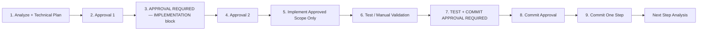

# Student Profile Master Implementation Plan

**Project:** Edafaa / OpenEduCat Odoo 19  
**Workspace:** `/opt/localaddons`  
**Related analysis:** [`student_profile_requirements_gap_analysis.md`](student_profile_requirements_gap_analysis.md)  
**Plan date:** 2026-06-07  
**Last updated:** 2026-06-07 (Step 1 closed — git blocker)  
**Status:** Step 1 **closed** (implemented + tested; commit blocked). Step 2 **not started**.

---

## 1. Project Decision

| Decision | Value | Rationale |
|----------|-------|-----------|
| **Target profile model** | `op.student` | Client-facing SIS student profile; used by admissions, enrollments, parents, fees, attendance |
| **Custom addon** | `edafaa_student_profile` | All new logic, views, sequences, and constraints live here — keeps changes small and reversible |
| **Base module policy** | **No direct modification** to OpenEduCat core, third-party, or existing custom base modules | Use `_inherit` + XML view inheritance only |
| **Secondary models** | `op.course`, `op.program`, `op.parent`, `op.student.course` | Extended via `edafaa_student_profile` where needed; never patch `openeducat_core` files |
| **Out of scope (unless approved later)** | `gr.student`, `motakamel.program` | Parallel stacks; not client-facing SIS profile unless analysis proves otherwise |

### Addon skeleton (created only after Step 1 approval)

```
edafaa_student_profile/
├── __init__.py
├── __manifest__.py          # depends: openeducat_core, openeducat_parent (as needed per step)
├── models/
├── views/
├── data/                    # sequences, optional demo
├── security/
└── docs/                    # per-step analysis / implementation / test notes
```

### Per-step documentation convention

Each gated step **must** create or update three artifacts:

| Artifact | Path (addon exists) | Path (addon not yet created) |
|----------|---------------------|------------------------------|
| Analysis note | `edafaa_student_profile/docs/step-XX-<slug>-analysis.md` | `/opt/docs/student_profile/step-XX-<slug>-analysis.md` |
| Implementation note | `edafaa_student_profile/docs/step-XX-<slug>-implementation.md` | `/opt/docs/student_profile/step-XX-<slug>-implementation.md` |
| Test result note | `edafaa_student_profile/docs/step-XX-<slug>-test-result.md` | `/opt/docs/student_profile/step-XX-<slug>-test-result.md` |

When the addon is created, move or copy step docs into `edafaa_student_profile/docs/` before commit.

---

## 2. Gated Workflow

Every requirement follows the same strict pipeline. **No step may skip a gate.**



### Two approval gates (mandatory)

| Gate | When | What is approved | Code allowed after? |
|------|------|------------------|---------------------|
| **Approval 1** | After analysis + technical plan | Findings, target model, field strategy, risks, test outline | **No** |
| **Approval 2** | After **APPROVAL REQUIRED — IMPLEMENTATION** block | Exact files, views, sequence design, test cases, rollback plan | **Yes** — implement only approved scope |

**Do not write code after analysis unless Approval 2 is explicitly given.**

### Testing before commit (mandatory)

After implementation, **do not commit immediately.**

1. Run all required tests / manual validation for the step.
2. Update the **implementation note** and **test result note**.
3. Post the **TEST + COMMIT APPROVAL REQUIRED** block.
4. **Stop and wait** for commit approval.

Commit is allowed **only** when:

- All test cases for the step **PASS**
- No unrelated files are changed
- `git diff` / `git diff --stat` is reviewed
- Implementation note and test-result note are updated

### Pre-implementation checklist (required in analysis + IMPLEMENTATION block)

- [ ] Impacted model(s)
- [ ] Impacted view(s) (inherit IDs)
- [ ] Reused fields
- [ ] New fields
- [ ] Sequence impact
- [ ] Security impact
- [ ] Portal impact
- [ ] Report / email impact
- [ ] Test scenario(s)
- [ ] Rollback plan

### Prohibited actions

- Coding before **Approval 2**
- Committing before tests pass and commit approval
- Combining multiple requirements in one step unless explicitly approved
- Editing files inside `openeducat_core`, `openeducat_parent`, etc. directly
- Force-pushing or amending commits across steps
- Implementing `gr.student` bridge without separate approval

---

## 3. Requirement Breakdown

| Step | Requirement | Priority | Current Status | Target Model | Needs Approval Before Coding | Test Required |
| ---- | ----------- | -------- | -------------- | ------------ | ---------------------------- | ------------- |
| 1 | A. Auto Course Code `CRS-XXXX` | P1 | **Closed** — implemented in `edafaa_student_profile`; commit blocked (no repo access) | `op.course` | Done | Passed 8/8 |
| 2 | B. Auto Program Code `PRG-XXXX` | P1 | **Partial** — manual `op.program.code`; unrelated `PROG-` on `motakamel.program` | `op.program` | Yes | Yes |
| 3 | C. Student required fields | P1 | **Partial** — fields exist but incomplete; Arabic missing; `id_number` not in views; portal drops Arabic | `op.student` (+ portal inherit if approved) | Yes | Yes |
| 4 | D. Siblings visible in student profile | P1 | **Missing** — parent M2M exists; no sibling compute or UI | `op.student` | Yes | Yes |
| 5 | E. Student status and training summary | P1 | **Missing** — no profile-level status; enrollment `state` on `op.student.course` only | `op.student` | Yes | Yes |
| 6 | F. Courses tab in student profile | P1 | **Partial** — `course_detail_ids` exists; tab only in `openeducat_library` alternate form | `op.student` | Yes | Yes |
| 7 | G. Skills tabs for course/program | P2 | **Missing** — Subjects tab only on course; no skills model | `op.course`, `op.program` | Yes | Yes |
| 8 | H. Certificate workflow | P2 | **Partial** — bonafide wizard on `op.student`; full email/PDF on `gr.certificate` | `op.student` (+ optional bridge) | Yes | Yes |

### Priority legend

- **P1** — Core student profile parity for SIS UAT
- **P2** — Curriculum depth and certificate automation (higher design risk)

### Dependency order (recommended)

```
Step 1 (CRS) ──┐
Step 2 (PRG) ──┼── independent; may run in parallel only if explicitly approved
               │
Step 3 (Fields) ──► Step 4 (Siblings) ──► Step 5 (Status) ──► Step 6 (Courses tab)
                                                      │
Step 7 (Skills) ──────────────────────────────────────┘ (independent of 3–6)
Step 8 (Certificate) ── after Step 6 recommended (enrollment context)
```

---

## 4. Step-by-Step Execution Plan

### Step 1 — Auto Course Code `CRS-XXXX`

**Requirement A**

#### Analysis required

| Check | Question | Known baseline (gap analysis) |
|-------|----------|-------------------------------|
| Course model | Confirm target | `op.course` in `openeducat_core/models/course.py` |
| Code field | Reuse or new? | Reuse existing `code` Char, `required=True`, unique constraint |
| Sequence | Exists? | **No** `ir.sequence` for `op.course` in localaddons |
| Views | Which to inherit? | `openeducat_core.view_op_course_form` — make `code` readonly when auto-generated |
| Manual override | Allowed? | Must confirm with client; test plan assumes manual code preserved if provided |

#### After approval — implementation scope

- Add `data/course_sequence.xml` → `ir.sequence` code `edafaa.op.course`, prefix `CRS-`, padding 4
- `models/course.py` — `_inherit` `op.course`, override `create()` to assign sequence when `code` empty/false
- `views/course_views.xml` — inherit form: `code` readonly with optional force-manual group (if approved)
- `__manifest__.py` — depend on `openeducat_core`

#### Test

| # | Test case | Expected |
|---|-----------|----------|
| T1.1 | Create course without code | `code` = `CRS-0001` (then `CRS-0002`, …) |
| T1.2 | Create course with manual code `CUSTOM-01` | Manual code preserved; sequence not consumed (if approved behavior) |
| T1.3 | Uniqueness | Duplicate codes rejected |
| T1.4 | Form UX | Code field readonly after auto-assign |

**Deliverables:** analysis note, implementation note, test result, single commit.

---

### Step 2 — Auto Program Code `PRG-XXXX`

**Requirement B**

#### Analysis required

| Check | Question | Known baseline |
|-------|----------|----------------|
| Program model | Confirm target | `op.program` in `openeducat_core/models/program.py` |
| Old `PROG-` logic | Where? | `motakamel.program.program_id` via sequence prefix `PROG-` — **different model**, not `op.program` |
| Reuse vs new | Decision | **Do not reuse** motakamel sequence; create `PRG-` for `op.program` unless client directs merge |
| Views | Which to inherit? | `openeducat_core.view_op_program_form` |

#### After approval — implementation scope

- Add `data/program_sequence.xml` → `ir.sequence` code `edafaa.op.program`, prefix `PRG-`, padding 4
- `models/program.py` — `_inherit` `op.program`, `create()` override
- `views/program_views.xml` — inherit form
- Document coexistence with `motakamel.program` in implementation note

#### Test

| # | Test case | Expected |
|---|-----------|----------|
| T2.1 | Create program without code | `code` = `PRG-0001` |
| T2.2 | Create program with manual code | Manual code preserved (if approved) |
| T2.3 | Motakamel unaffected | `motakamel.program` still uses `PROG-` on its own field |

---

### Step 3 — Required Student Fields

**Requirement C**

#### Analysis required

| Client field | Existing on `op.student` / partner | Gap |
|--------------|-------------------------------------|-----|
| Arabic name | **No** | New field `name_arabic` (or approved alternative) |
| English name | `first_name`, `last_name`, `name` | Map convention; possibly `name_english` |
| ID / National ID | `id_number` on model, **no view** | Expose + require |
| Email | `email` (partner) | Add ORM and/or XML required |
| Mobile | `phone` (partner) | Client says mobile — confirm `phone` vs new `mobile` |
| Birth date | `birth_date` | Add required constraint |
| Geographic address | `street`, `city`, `state_id`, `country_id`, … | Define minimum required subset |
| Portal create | `student_enrollment_portal` | `_create_student_record` drops `student_name_arabic` |

**Decision needed in analysis:** XML `required="1"` only vs `@api.constrains` / `required=True` on fields.

#### After approval — implementation scope

- `models/student.py` — `_inherit` `op.student`: new/reused fields, constraints
- `views/student_views.xml` — inherit `openeducat_core.view_op_student_form`: field layout, required attributes
- Optional separate approval: inherit `student_enrollment_portal` create mapping (prefer separate inherit module dependency)
- Security: no new model unless added; update access if new stored fields on existing model (usually none)

#### Test

| # | Test case | Expected |
|---|-----------|----------|
| T3.1 | Save without Arabic name | Blocked with clear error |
| T3.2 | Save without English name | Blocked |
| T3.3 | Save without ID / email / phone / birth date / address (per rules) | Blocked |
| T3.4 | Valid complete record | Saves successfully |
| T3.5 | Portal registration → student | Arabic and English populated on `op.student` |

---

### Step 4 — Siblings Visible in Student Profile

**Requirement D**

#### Analysis required

| Check | Question | Known baseline |
|-------|----------|----------------|
| Parent model | Relation | `openeducat_parent`: `op.student.parent_ids` ↔ `op.parent.student_ids` |
| Sibling logic | How computed? | Siblings = other `op.student` sharing any `parent_ids`; exclude self |
| UI placement | Tab vs section | New notebook page **Siblings** or group under **Family** |
| Parents on form | Include? | Likely add `parent_ids` alongside siblings (confirm scope) |
| `child_ids` confusion | Partner contacts | Not siblings — do not reuse |

#### After approval — implementation scope

- `models/student.py` — `sibling_ids` Many2many computed, stored optional
- `views/student_views.xml` — Siblings tab; optional Parents field
- Depends on `openeducat_parent` in manifest

#### Test

| # | Test case | Expected |
|---|-----------|----------|
| T4.1 | Parent P linked to students A and B | A shows B as sibling; B shows A |
| T4.2 | Student with no parents | Empty siblings list |
| T4.3 | Student with one parent, one child | No self-reference in siblings |

---

### Step 5 — Student Status and Training Summary

**Requirement E**

#### Analysis required

| Check | Question | Known baseline |
|-------|----------|----------------|
| Enrollment model | Source of truth | `op.student.course` — `state`: `running` / `finished` |
| Lifecycle labels | Client mapping | new trainee → currently registered → completed |
| Compute rules | Definition | e.g. no enrollments = new; any `running` = active; all `finished` = completed |
| Current batch/course | Display | Computed from latest `running` enrollment |
| vs `gr.student.state` | Ignore for SIS | Do not merge unless approved |

#### After approval — implementation scope

- `models/student.py` — `lifecycle_status` Selection (computed/stored), `current_course_id`, `current_batch_id`, summary counts
- `views/student_views.xml` — header badge or summary group on profile
- Optional: smart button to enrollments

#### Test

| # | Test case | Expected |
|---|-----------|----------|
| T5.1 | Student with no enrollments | Status = new trainee (or agreed label) |
| T5.2 | Student with running enrollment | Status = currently registered; current course/batch shown |
| T5.3 | All enrollments finished | Status = completed |
| T5.4 | Mixed running + finished | Status = currently registered (document rule) |

---

### Step 6 — Courses Tab in Student Profile

**Requirement F**

#### Analysis required

| Check | Question | Known baseline |
|-------|----------|----------------|
| Relation field | Best fit | `course_detail_ids` → `op.student.course` |
| Reference view | Existing UI | `openeducat_library` Educational page — list without `state` |
| Default form | Target | `openeducat_core.view_op_student_form` — only **Other Information** tab today |
| Columns | Required | course, batch, roll number, status (`state`), dates if available |
| Certificate placeholder | Step 8 link | Optional column for certificate number — stub until Step 8 |

#### After approval — implementation scope

- `views/student_views.xml` — notebook page **Courses** with embedded list/form of `course_detail_ids`
- No duplication of library view — single canonical tab on default student form
- Depends on `openeducat_core`; no need for `openeducat_library`

#### Test

| # | Test case | Expected |
|---|-----------|----------|
| T6.1 | Student with multiple enrollments | All rows visible with correct status |
| T6.2 | Open from SIS Students menu | Courses tab on default form |
| T6.3 | Create enrollment from tab (if editable) | Saves and links to student |

---

### Step 7 — Skills Tabs for Course and Program

**Requirement G**

#### Analysis required

| Check | Question | Known baseline |
|-------|----------|----------------|
| Subjects tab | Current | `op.course.subject_ids` → `op.subject` — **keep unchanged** |
| Skill model | Exists? | **No** `op.skill` in localaddons |
| Approach | New vs enterprise | New lightweight `edafaa.skill` + M2M recommended unless HR Skills licensed |
| Program form | Current | No notebook — add Skills page + optionally leave structure minimal |
| Rename Subject? | **Forbidden** | Do not rename Subjects to Skills |

#### After approval — implementation scope

- `models/skill.py` — new model `edafaa.skill` (or agreed name)
- `models/course.py`, `models/program.py` — `skill_ids` Many2many
- `views/course_views.xml`, `views/program_views.xml` — **Skills** notebook pages
- `security/ir.model.access.csv`

#### Test

| # | Test case | Expected |
|---|-----------|----------|
| T7.1 | Add skills to course | Skills tab persists; Subjects tab unchanged |
| T7.2 | Add skills to program | Skills tab on program form |
| T7.3 | Access rights | Non-admin can read; editor can write (per security matrix) |

---

### Step 8 — Certificate Workflow

**Requirement H**

#### Analysis required

| Check | Question | Known baseline |
|-------|----------|----------------|
| Bonafide | SIS today | `bonafide.certificate.wizard` sets `certificate_number` on print |
| `gr.certificate` | Training stack | Email, PDF, verification — linked to `gr.student` |
| Target integration | `op.student` | Confirm: extend bonafide, wrap `gr.certificate`, or new `edafaa.student.certificate` model |
| UI | Profile elements | Certificate number visible; attachment/link; Send button |
| Email template | Reuse or new | `mail.template` in `edafaa_student_profile` |
| Portal | Out of scope? | Portal download fix may be separate sub-step |

#### After approval — implementation scope

- Defined only after analysis — likely: visible `certificate_number`, certificate list or smart button, send-mail action, link to PDF/report
- **No** integration with `gr.student` unless explicitly approved

#### Test

| # | Test case | Expected |
|---|-----------|----------|
| T8.1 | Issue certificate | Number assigned and visible on profile |
| T8.2 | Send email | Student receives mail with attachment/link |
| T8.3 | Re-send guard | Idempotency or audit per approved design |

---

## 5. Approval Formats

### Approval 1 — Analysis and technical plan

Requested after analysis document is published. Reply example: **`Approved — Step 1 analysis`**

Confirms: findings, target model, manual-code policy, migration stance, test outline.

---

### Approval 2 — Before coding (required output)

Before any implementation, work **stops** and this block is posted:

```
APPROVAL REQUIRED — IMPLEMENTATION

Step:
Requirement:
Analysis document:
Current finding:
Approved target model:
Approved fields:
Approved views:
Files expected to change:
Security impact:
Sequence impact:
Portal impact:
Report/email impact:
Risk:
Rollback plan:
Test cases to run:
```

**Do not proceed until Approval 2 is explicitly given** (e.g. `Approved — Step 1 implementation`).

---

## 6. Post-Implementation Output Formats

### Test result note (per test case, in `step-XX-*-test-result.md`)

```
TEST RESULT

Step: <1–8>
Test Case: <T.x.x name>
Expected: <expected behavior>
Actual: <observed behavior>
Status: PASS | FAIL
Screenshot/Log: <path, odoo log excerpt, or SQL id>
Notes: <regressions, follow-ups>
```

Aggregate step status: all cases **PASS** before requesting commit.

---

### TEST + COMMIT APPROVAL REQUIRED (after coding and testing)

After implementation and tests, work **stops** and this block is posted:

```
TEST + COMMIT APPROVAL REQUIRED

Step:
Requirement:
Files changed:
Tests executed:
Passed:
Failed:
Evidence paths/logs:
git status:
git diff --stat:
Remaining risks:
Recommendation:
Ready to commit: Yes/No
```

**Do not commit until explicit commit approval is given.**

---

## 7. Commit Rules

| Rule | Detail |
|------|--------|
| Timing | **After** tests pass + TEST + COMMIT APPROVAL REQUIRED + commit approval |
| Granularity | **One commit per approved step** |
| Message format | `[student-profile] Step X: <short description>` |
| Staging | Only files for that step |
| No unapproved files | Do not commit analysis-only or WIP from other steps |
| Pre-commit output | Always show `git status` and `git diff --stat` in TEST + COMMIT block |
| Docs | Implementation note + test result note updated before commit |
| Hooks | Never skip hooks unless user explicitly requests |
| Push | Only when user explicitly requests |

### Example commit messages

```
[student-profile] Step 1: auto CRS course code sequence on op.course
[student-profile] Step 3: required bilingual and ID fields on op.student
```

---

## 8. Current Status

| Action | Status |
|--------|--------|
| Master plan document | **Done** (this file) |
| Governance rules v2 | **Done** (dual approval, test-before-commit) |
| Step 1 | **Closed** — see [§9 Step 1 Final Status](#9-step-1-final-status) |
| Step 2–8 | **Not started** |
| Git commit (Step 1) | **Blocked** — see handoff doc |

### Immediate next step

**Owner action required** — resolve git access (see §9). Do **not** retry clone unless access/token/repo URL changes. Do **not** start Step 2 until owner directs otherwise.

---

## 9. Step 1 Final Status

| Item | Status |
| ---- | ------ |
| Requirement | Auto Course Code `CRS-XXXX` |
| Addon | `/opt/localaddons/edafaa_student_profile/` |
| Implementation | **Done** |
| Tests | **Passed 8/8** (T1.1–T1.8 on `sabry-test`) |
| Functional acceptance | **Accepted** |
| Commit | **Blocked** |
| Blocker | No access to `EDAFA-org/kafaat` from current GitHub identity |
| Repo user detected | `CIHYALACE` |
| Next action | Grant repo access / provide PAT / provide correct repo URL |

### Git blocker note

The repository could not be cloned:

- HTTPS clone failed due to missing GitHub credentials.
- SSH authenticated as `CIHYALACE`, but repository access was denied.
- GitHub API returned 404 for `EDAFA-org/kafaat`.
- Public repos under `EDAFA-org` were empty from this identity.
- Therefore, no branch, staging, commit, or push was possible.

**Do not retry clone** unless access/token/repo URL changes. **Do not** run `git init`. **Do not** push.

### Ready-to-commit file list

When repo access is available, commit only these files under `localaddons/edafaa_student_profile/`:

- `localaddons/edafaa_student_profile/__init__.py`
- `localaddons/edafaa_student_profile/__manifest__.py`
- `localaddons/edafaa_student_profile/models/__init__.py`
- `localaddons/edafaa_student_profile/models/course.py`
- `localaddons/edafaa_student_profile/data/course_sequence.xml`
- `localaddons/edafaa_student_profile/views/course_views.xml`
- `localaddons/edafaa_student_profile/docs/step-01-auto-course-code-implementation.md`
- `localaddons/edafaa_student_profile/docs/step-01-auto-course-code-test-result.md`

| Git item | Value |
|----------|-------|
| Planned branch | `feature/student-profile-p1-crs-code` |
| Planned commit message | `[student-profile] Step 1: auto CRS course code sequence on op.course` |

### Required next action from owner

One of:

1. Grant GitHub access to user/key `CIHYALACE` on `EDAFA-org/kafaat`.
2. Provide a valid GitHub PAT/token with repo access.
3. Provide the correct repository URL.
4. Manually download/clone the repo on the host, then provide the local path.

### Step 1 documentation

| Document | Path |
|----------|------|
| Analysis | [`student_profile/step-01-auto-course-code-analysis.md`](student_profile/step-01-auto-course-code-analysis.md) |
| Implementation | `localaddons/edafaa_student_profile/docs/step-01-auto-course-code-implementation.md` |
| Test results | `localaddons/edafaa_student_profile/docs/step-01-auto-course-code-test-result.md` |
| Git handoff | [`student_profile/step-01-git-handoff.md`](student_profile/step-01-git-handoff.md) |

---

## Appendix A — Module dependency plan

| Step | `edafaa_student_profile` depends on |
|------|-------------------------------------|
| 1, 2 | `openeducat_core` |
| 3 | `openeducat_core` (+ `student_enrollment_portal` if portal fix in scope) |
| 4 | `openeducat_core`, `openeducat_parent` |
| 5, 6 | `openeducat_core` |
| 7 | `openeducat_core` |
| 8 | `openeducat_core` (+ others per analysis) |

---

## Appendix B — Risk register (summary)

| Step | Risk | Mitigation |
|------|------|------------|
| 1–2 | Existing records without codes | Analysis documents migration; no retroactive assign without approval |
| 2 | Confusion with `motakamel` `PROG-` | Clear docs; separate sequence |
| 3 | Legacy students fail new constraints | Staged enforcement or `noupdate` exceptions |
| 3 | Portal module coupling | Optional sub-approval for portal inherit |
| 4 | Performance on sibling compute | `parent_of` indexed relations; stored M2M if needed |
| 5 | Ambiguous lifecycle rules | Document rules in analysis; client sign-off |
| 7 | Scope creep vs HR Skills | MVP skill tags in Step 7 analysis |
| 8 | Split certificate systems | Analysis must pick one path for `op.student` |

---

*End of master plan. Step 1 closed (git blocker). Step 2+ await owner direction after repo access or explicit go-ahead.*
